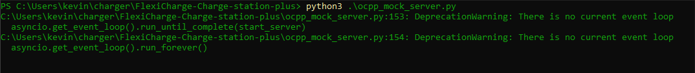
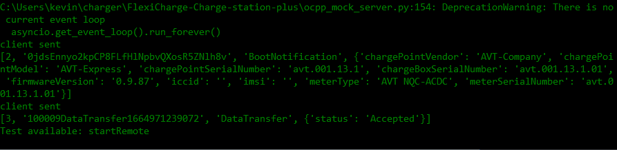

# __OCPP Mock server developer guide__
This is a description of how the mock server is used to fake the communication to the charger with the OCPP interface.

## __Booting up the server__
To start the server you need to first check the config.py file. 

Make sure the _useMockServer variable is set to True.

    def init(self):
        self._useMockServer = True
        self._mockServerIP = 'ws://127.0.0.1:60003'

        self._iPAddress = "ws://18.202.253.30:1337/charger/"
        self._chargerSerialNumber = "testnumber13"

        self._protocols = ['ocpp1.6']
        self._pingInterval = 5  # Websocket ping interval in seconds.
        self._timeout = None  # Websocket timeout in seconds.

## __Starting the ocpp_mock_server.py__
To start the mock server you open a new terminal and locate the ocpp_mock_server.

py file in the directory then you execute the code.
e.g of idle server after boot 

## __Server setup and use case__
these are the adress and port setup for the server. This specific IP should work for all OS without an issue. The .run_forever() call will keep the server up until you exit it yourself. This means you dont have to restart the server every time you disconnect the charger.

    start_server = websockets.serve(ocpp_server, "127.0.0.1", 60003) #set server ip and port

    asyncio.get_event_loop().run_until_complete(start_server)
    asyncio.get_event_loop().run_forever()

## __Connecting to the server__

When connecting to the server it will respond with the BootNotification confirmation and then send out a DataRequest right after. This is the initial handshake between the charger and the server. After this both sides should be available for requests to be sent.

## __StartRemoteTransaction Request__
This is one of the main features that we tested during our time on FlexiCharge. currently the setup is to wait in the terminal for the user to type in startRemote to send the request. Currently the server is setup to test startRemoteTransaction but this can easily be changed by altering this part of the code.

__Note__ That on the raspberry pi its difficult to use an a second terminal for the mock server while running the statemachine. Currently there is a time.sleep(5) on the raspberry before it send out the startRemoteTransaction request.

    if message_json[2] == "DataTransfer":
              print("Test available: startRemote")
              user_input = input()
              if user_input == "startRemote":
                    await websocket.send(json.dumps(start_remote_transaction_request))

After inputing startRemote into the terminal you should receive a RemoteStartTransaction.conf from the charger and the the charging should commence. After this the server should print out the live metric values that the charger is sending to the server. __See image below__